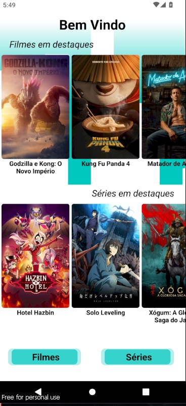
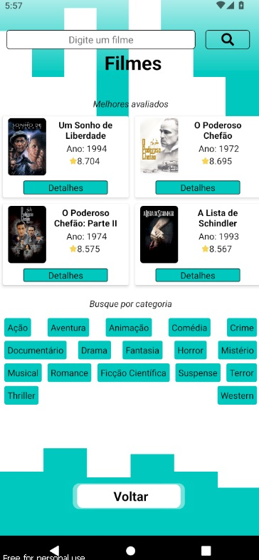
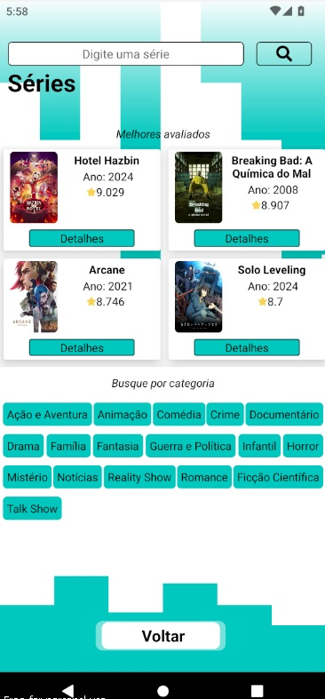
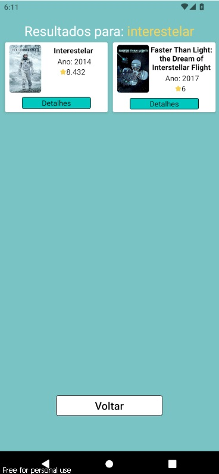
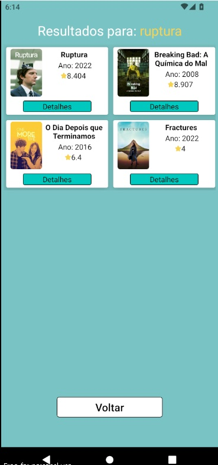
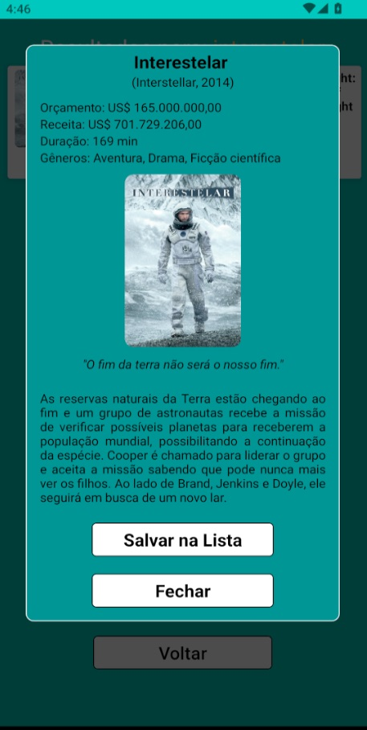
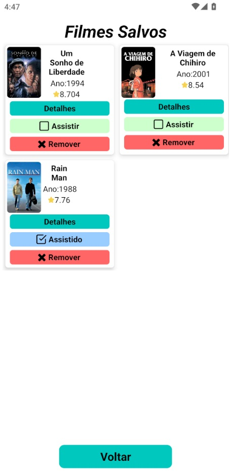
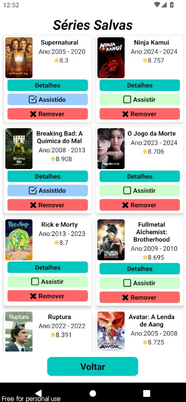

# 📱 API Filmes e Séries

## ✨ Introdução✨ 

Bem-vindo à minha **API de Filmes e Séries**! Este projeto foi criado para conseguir buscar dados de filmes e séries. Aqui está uma visão geral do que você encontrará:

## 🚀 Funcionalidades

- Página Inicial: Destaques atuais;
- Página de Filmes: Filmes mais bem avaliados pelo público;
- Página de Séries: Séries mais bem avaliadas pelo público;
- Buscar Filmes e Séries por nome ou gênero;
- Salvar Filmes e Séries em uma lista para assistir depois;
- Ler detalhes de Filmes e Séries como ano de lançamento, resumo, receita e gênero;

## ⚙️ Tecnologias Utilizadas:
    - ⚛️ React Native;
    - ⚛️ Expo;
    - 🚀 TypeScript;

 
Este projeto utiliza dados fornecidos pela [API do TMDB](https://www.themoviedb.org/api-terms-of-use)

 ## Instalação

### Android

1. Faça o download do APK mais recente do [Aplicativo](https://github.com/Emerson2342/API-filmes/releases).
2. Instale o APK no seu dispositivo Android.

### iOS

Atualmente não suportado.

  ## 📸 Screenshots

 | 
|:--:|:--:|
|
|:--:|:--:|
| 
|:--:|:--:|
 | 
|:--:|:--:|
 | 
|:--:|:--:|

  ## Licença

-**Suporte**
    Para suporte ou feedback, entre em contato via WhatsApp: +55 (61) 99835-4398 (https://wa.me/5561998354398) ou pelo email: lyncoln_erc@hotmail.com

---
2024 | Desenvolvido por Emerson Ribeiro

